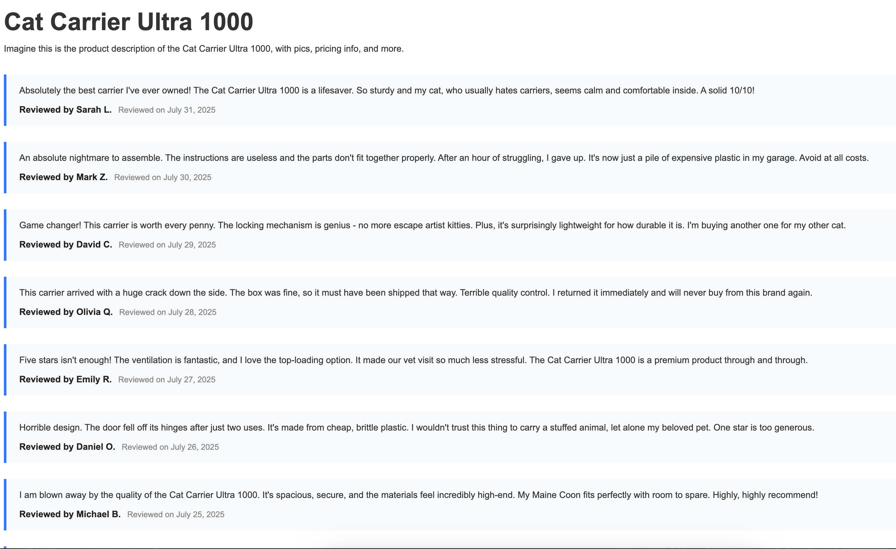
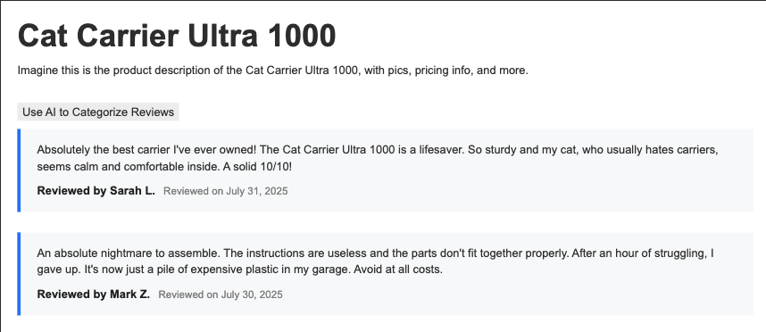

# Using on-device AI to Enhance Webflow CMS Content

Most people's interactions with AI are via (hopefully) helpful bots and tools like ChatGPT. AI can be used nearly everywhere to (again, hopefully) enhance and expand the experience. One of the new frontiers for AI is directly in the web browser itself, thanks to efforts by the Google Chrome team. Chrome's [built-in AI](https://developer.chrome.com/docs/ai) feature aims to bring the power of a large language model directly to the user's browser itself. Of course, this is in a somewhat smaller form, using the Gemini Nano model, but it still brings quite a bit of power to web developers. Even better, it can run completely offline, and basically for free. No API keys are required! 

This feature is still in early days and changing rapidly, but broadly, the Chrome team supports task focused APIs as well as a general purpose prompting API. Current features include:

* Both language detection and translation
* Writing and Rewriting text for tone and length
* Summarization of content
* Proofreading content
* And of course, a general purpose prompt.

Right now this is a Chrome-only feature, but other Chromium browsers (like Microsoft Edge) will probably support this as well. Even within Chrome, support isn't 100% baked in yet. The Chrome team has a [dedicated API status and overview](https://developer.chrome.com/docs/ai/built-in-apis) page that clearly states what's available generally as well as what's available for Chrome versus Chrome extensions. 

Given all this, you might be disinclined to even consider this feature, but keep in mind this is a great example of where Progressive Enhancement comes into play. When all of these APIs are generally available in the released version of Chrome, a significant percentage of users will have access to these APIs. Also, by their very nature many of these APIs can act as useful helpers, so for example, providing the ability to summarize content on the page is a great addition to a web page, but not something that's necessarily required. 

Alright, with all of that pre-amble out of the way, how can we actually make use of these APIs?

## The Prompt API at a high level

The API I'm using for my demo today is the [Prompt API](https://developer.chrome.com/docs/ai/prompt-api). This is the general purpose API that will be most useful for our particular demo. At the time this blog post is being written, the Prompt API for Chrome itself (not extensions) is behind a flag: "Prompt API for Gemini Nano". This must be enabled in `chrome://flags` before it can be used. When released, this will not be required. 

There are also pretty strict [hardware requirements](https://developer.chrome.com/docs/ai/prompt-api#hardware-requirements) as well. There's nothing you as a developer can do about that, but it's something to keep in mind if your audience is primarily using older, lower-powered devices. (And as good web developers, we all check for that, right?) The code itself (that you will see in a moment) handles this for us so there isn't anything special you need to do in your code to handle this.

The final requirement is a bit interesting. Since we're talking about downloading a large model, Chrome restricts *just* the downloading aspect until the user has a "meaningful interaction" with the page. This is a somewhat recent change to the feature and can be a bit tricky if you aren't expecting it. The [docs](https://developer.chrome.com/docs/ai/get-started#user-activation) go into some detail, but the simplest solution is just put the interaction (whatever you're doing with AI) behind a button click. And given that some people don't want to use AI, this gives them a choice as well.

Alright, speaking of code, the first step is to simply check for the API itself:

```js
if(!('LanguageModel' in window)) {
    // either silently ignore, or let the user know
    return;
}
```

If the user does have the API, your next step is to use the `availability` method, which does a few things:

* It checks the hardware requirements mentioned above, and if it's determined that this device cannot support the API, `unavailable` will be returned.
* If everything is awesome, then `available` is returned.
* The model used by Chrome's AI feature, Nano, is "small", but that's a relative term. It's still a LLM model that's going to take up some space on the user's hard drive. Luckily, this is usable by any and all websites, a user doesn't have to download it for every site making use of the feature. But to handle this state, the `availability` method can also return `downloadable` and `downloading`. In this case, the API will be usable once the download finishes. You'll see how to handle that in a moment.

Here's an example:

```js
const availability = await LanguageModel.availability();
```

After you have determined the user *can* use the API (the result should be one of `available`, `downloadable`, or `downloading`), you can create a session. The session represents your interaction with the AI model, and each of the APIs has various options you can use to customize how the session will work. Remember that this may need to be after user interaction with the web page. 

For the Prompt API, we can keep it rather simple:

```js
// Copied from the docs: https://developer.chrome.com/docs/ai/prompt-api#use_the_prompt_api
const session = await LanguageModel.create({
  monitor(m) {
    m.addEventListener('downloadprogress', (e) => {
      console.log(`Downloaded ${e.loaded * 100}%`);
    });
  },
});
```

Note the argument passed to the `create` method is an event handler for downloading. In this example, a message is being logged to the console, but in nearly every single real use case, you will want to let the user know by updating the DOM. It isn't required, and it doesn't always need to be displayed, but generally you should. (For the demo I'm sharing I actually don't do this as it doesn't make sense in context.) 

As a quick note, even if the model has been downloaded and the result of the `availability` method was `available`, the event handler for `downloadprogress` always fires twice - once with a `loaded` value of 0 and once with 1. This is instantaneous but it's something to keep in mind if you are updating the user on progress. 

Finally, you can call the model:

```js
let result = await session.prompt('Why are cats so much better than dogs?');
```

The result is a string value that you can use how you see fit. 

That's the gist of it, but as you can imagine, complex AI integrations are possible and will require quite a bit more work. Let's take a look at a real-word use case for this within Webflow.

## Using AI with Webflow CMS content

In my Webflow site, I've got a set of product reviews that have been created by customers. These reviews are just blocks of text, a name, and a date when the review was created. 

On my site, I created a page and added a `Collection List` component tied to my reviews, sorted by the date when the review was created. I did a bit of design work in the `Collection Item` block to nicely render each review with a blue border to the right. You can see this for yourself here, <https://chrome-ai-test.webflow.io/review-demo-page>, but here's a screenshot:



Right now, this page is just fine. It works! But how can we use on-device AI to improve it? 

Taking a look at each review, we can use JavaScript to get access to the text of the review itself. Each of these reviews can then be checked for sentiment. After that, we can then highlight in some way the positive versus negative results. The important thing to remember is that this is an *additional* feature of the page, an enhancement, for those people who can actually use it. 

Alright, let's get to it. In the Webflow Desiger, I went into my page settings and used the `Custom Code` feature, specifically code to be placed before the `</body>` tag. Let's start with a bit of setup code:

```js
async function canDoIt() {
	if(!window.LanguageModel) return false;
	return (await LanguageModel.availability()) !== 'unavailable';
}

document.addEventListener('DOMContentLoaded', init, false);

async function init() {
		
	let canWe = await canDoIt();
	if(!canWe) {
		return;
	}

	console.log('This browser can do AI stuff.');

  let reviewList = document.querySelector('#reviewList');
  let btnHTML = `
  <p>
  <button onclick="doReviews()">Use AI to Categorize Reviews</button>
  </p>
  `;
  reviewList.insertAdjacentHTML('beforebegin',btnHTML);
}
```

From the top, I'm using my `DOMContentLoaded` handler to run code when the page is loaded, the first of which is a call to utility function, `canDoIt()` (admittedly not the best name) that does the base feature detection followed by a call to `availability` on the `LanguageModel` object. In this case we're enhancing the page, so there's no need to let the user know anything went wrong. Life is perfect. Carry on. 

If the AI model is supported, we need to add some form of user interaction in order to kick things off. *Technically* this is only really required when the status is in `downloading` or `downloadable`, so you could skip this if you wish. My solution was simple - add a button with a `click` event that will fire off the AI specific work and insert it before the reviews. You can see that below:



Alright, now comes the complex part. Generally our process will break down to:

* Get all the reviews which is simple DOM API calls.
* For each set of review text, do setiment analysis.
* Based on the result, apply a CSS style that represents positive or negative. Items in the middle won't be touched and will keep their blue style. 

Let's look at that. First, `doReviews`:

```js
async function doReviews() {
	let session = await LanguageModel.create({
		initialPrompts: [
			{role:'system', content:'You rate the sentiment value of text, giving it a score from 0 to 1 with 0 being the most negative, and 1 being the most positive.'}
		]
	});
	
  let reviews = document.querySelectorAll('div.review');

	console.log('Kicking off review analyzing.');
  
  // each review element is the wrapper dom
  
	for(let i=0; i<reviews.length; i++) {
  	let reviewText = reviews[i].querySelector('p').innerText;
    console.log('reviewText', reviewText);
		let result = await session.prompt([
			{
				role:"user",
				content: [ { type: "text", value:reviewText } ]
			}], { responseConstraint: schema });
		
		/*
			logic for display is:
			if result is <= 0.2, negative
			if result >= 0.7, positive
		*/

		if(result <= 0.2) {
			console.log('negative');
			reviews[i].classList.add('review-negative');
		} else if(result >= 0.7) {
			console.log('positive');
			reviews[i].classList.add('review-positive');
		} else console.log('neutral');
	
	}
}
```

We begin by creating a session with our model and using a common feature to GenAI, a system prompt. This helps direct the output from the system to match our needs, a numeric value representing sentiment. We're going to take another step to help with this in a bit.

Next, the reviews are fetched via `querySelectorAll` and for each one, the code starts off grabbing the text in the first paragraph. Then a call to the `prompt` method on our session object is run with the value of that review. Note the `responseConstraint` portion. This is an example of [structured output](https://developer.chrome.com/docs/ai/structured-output-for-prompt-api), where our code specifies the *exact* response it should get from the API. This is done via JSON Schema and was defined earlier in our code:

```js
const schema = {
	title:"Sentiment",
	description:"A rating of the sentiment (bad versus good) of input text.",
	type:"number", 	
	minimum:0,
	maximum:1
};
```

JSON Schema can help define incredibly complex data structures, but for this demo we just need to ensure the result falls into a range of 0 to 1. The final part handles the "what is negative" and "what is positive" value, which to be honest is something that you may want to think carefully about. A lot will depend on the nature of your product, reviews, audience, and so forth. In this case, one of two CSS styles were applied. I also added this in my page settings:

```html
<style>
.review-positive {
  border-left: 4px solid #00FF00; 
}

.review-negative {
  border-left: 4px solid #FF0000; 
}
</style>
```

The net result - the user (in a Chrome browser for now) hits the site, and once AI support is detected, the button is added on top. If they click, and after the model is downloaded (which again is a one time operation for all sites), the reviews will be checked and color coded accordingly. If you are on the latest Chrome and have enabled the proper flag, you can see this for yourself here: <https://chrome-ai-test.webflow.io/review-demo-page>. Of course, even if you aren't on Chrome you can hit that URL and nothing bad will happen. 

Here's a screen shot of it in action:


## Next Steps

If it isn't obvious from the multiple warnings above, this new feature is still somewhat bleeding edge. That being said, I truly think the ability to do generative AI completely on device, for free, is going to be mind blowing, especially in cases where it can progressively enhance the experience for your web site. If you want to learn more, spend some time in the [docs](https://developer.chrome.com/docs/ai/get-started) and check out the other APIs as well. 