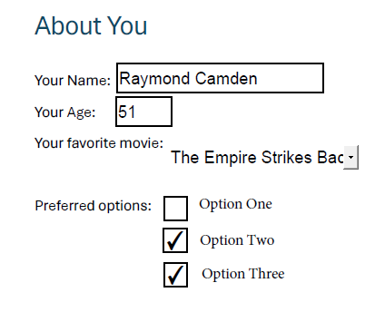

# Help Preview the Adobe Export and Import Form Data API

We've recently released two oft-requested APIs for Adobe Acrobat Services, the ability to both export and import form data from PDFs. These APIs are currently available to our beta program and not generally available, but read on for details on how these APIs work, and how you can sign up to help test them!

## Working with Forms

The Adobe Import/Export Form Data APIs can be incredibly important for organizations looking to handle either incoming forms or improve the experience for their users when filling out forms. Some possible use cases include:

* Processing incoming PDFs to take the filled forms and insert the contents into a database.
* Using known information about a user to prefill a form before they download, saving them time.

Before continuing, note that these APIs work with AcroForm/Static XFA forms only. Currently, the APIs are not supported in the SDKs but once released, the SDKs will be updated to add support. As we've covered the REST APIs many times in the past, we're going to skip demonstrating the authentication aspect as well as uploading. At the end, we'll share an entire script you can use in your testing.

## Exporting Form Data

Let's start with exporting form data, because even if you're use case is importing data, most likely you'll need to perform one export to get the 'shape' of the data. This will make more sense when we get to that section, but for now, imagine this simple form:

This form has 4 main questions:

* Your name (text field)
* Your age (a numeric field)
* A dropdown to select a movie
* A set of checkboxes

After filling out, and saving the PDF, it could look like so:

Now let's look at how the service works. From the [API reference](https://developer.adobe.com/document-services/docs/apis/#tag/Export-PDF-Form-Data), we can see that this endpoint has no options specific to the functionality. You pass an asset ID, or an external URL from a supported cloud platform, and simply start the job. As we've shared authentication and asset upload code before, we'll skip that here and simply show how easy it is to kick off a job:

https://gist.github.com/cfjedimaster/bd70c0b072609341c7f030ec4c35eba7

This function takes an asset, access token, and client ID as attributes. It kicks off the job and returns the URL pointing to the status. That's it! 

When the job is complete, the status includes information about how to access the result:

https://gist.github.com/cfjedimaster/3bb9663f5ded703040d9aca1f92c5f1c

You can then fetch that result and work with it:

https://gist.github.com/cfjedimaster/522f3c3820b7ce2a472e65c4dc75e19f

Given the sample shown above, the result looks like so:

https://gist.github.com/cfjedimaster/b7becf80f1087696b76437f3824b2609

Some things to note here:

* The numeric value, age, is returned as a string, so you will want to properly convert that (using `parseInt` probably) to a numeric value.
* The checkboxes return `Off` or Yes. When a PDF form is edited in Acrobat, the developer can specify the 'Export' value. This defaults to 'Yes' but could be something else. Most likely you will want to post-process this as well, perhaps to boolean true or fale values. 
* There is no inherit "grouping" of the checkboxes. If you wanted to store them as one value, like an array of true/false values, then you will need to handle that in your code.

Once you've identified if you do need post processing and have added it, you can then take this data and insert it into your database, save as a file (CSV perhaps), or work with it in any way that makes sense. Here's a complete script making use of the API. In order to run this, you will need beta access (documented below) for your credentials.

https://gist.github.com/cfjedimaster/24d4e5a78af3c30abd7a3321c686ec3a
## Importing Form Data

The other half of our new form support allows you to set form data for a PDF. In order to use this API, you need a PDF with a form of course, and you need your data. If you remember, we mentioned above that getting form data can be useful here. Why? When you get form data, you see the 'shape' of the output. If you remmeber, our test PDF had a shape like this when output:

https://gist.github.com/cfjedimaster/83847ba172318f18e0d0be4765c67176

You can use this data to help you integrate the API. Your input data may be from a HTML form post, a database table, or an incoming REST call, and probably will *not* match that shape. Your code will need to reshape it to match what is required. 

Another important thing to note is that **all values must be strings**, even in the case of a numeric value like `age` from my PDF. 

API wise this is very similar to the last call, with the only difference being the inclusion of the data you wish to set in the form. Here's an example method that shows how to do this:

https://gist.github.com/cfjedimaster/18437345ab90f98005b07d673249ae06

As with every other API call, you'll get a job URL back, you'll ping that for status, and when done, you get an asset ID pointing to the PDF result. The `data` attribute above maps to `jsonFormFieldsData` sent to the API and represents the key/value pairs of what you want to set in the form. Let's look at an example:

https://gist.github.com/cfjedimaster/f8c26557959f0ad08715a0abc8b729cd

We've got three values (hard coded, but would be dynamic of course) each with different sets of key/value pairs for the form. Our code begins (after authentication) by uploading the blank PDF with the form. It then uses that asset for each value in the array of inputs, waits for the job to finish, and then downloads it. 

Here's one sample result:

Here's the complete script:

https://gist.github.com/cfjedimaster/6a4a5ae7242ce8860eabd0684772052c

## A Note on Invalid Data

We've emphasized the importance of getting the 'shape' right when importing data into forms. It's also important to get the *values* right as well. In our sample PDF, we had a drop down with three values. If you attempt to set that field to a value not in the dropdown, the API will return an error. Here's an example:

https://gist.github.com/cfjedimaster/1bc2fed58c68fd3cea23609fbbc44f1f

When preparing your data to send to the API, it is important to keep this in mind, and ensure your code is using error handling to trap and log issues with your data.

## Ready to Test?

If you want to try out the service while it's in beta, fill out the [form](https://developer.adobe.com/document-services/pricing/contact/sales/form-data-api/) and you'll be contacted with details soon after. In the meantime, check the [REST API](https://developer.adobe.com/document-services/docs/apis/) docs for more details on this, and our other, Acrobat APIs.

