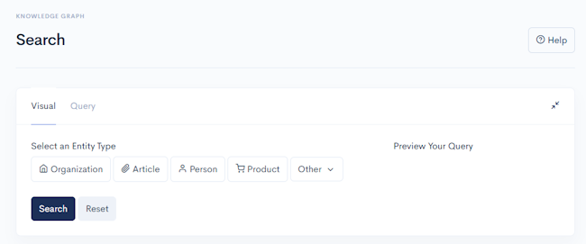
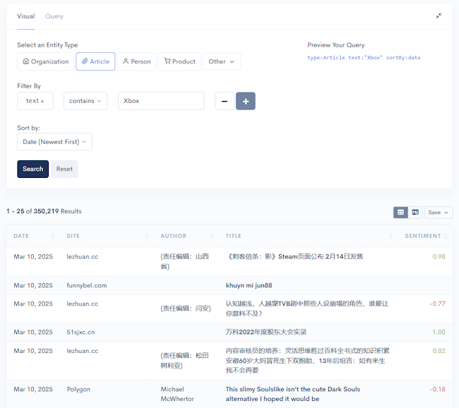
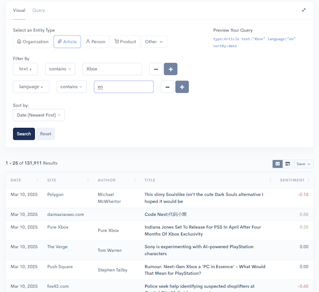
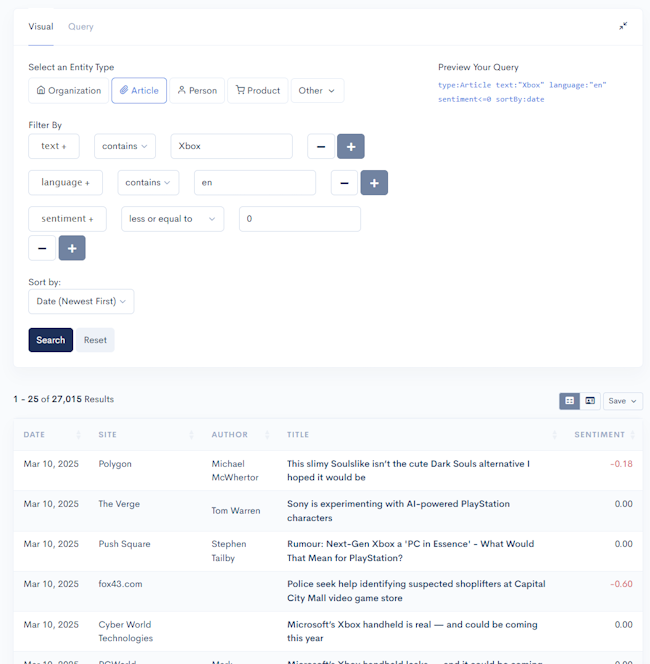
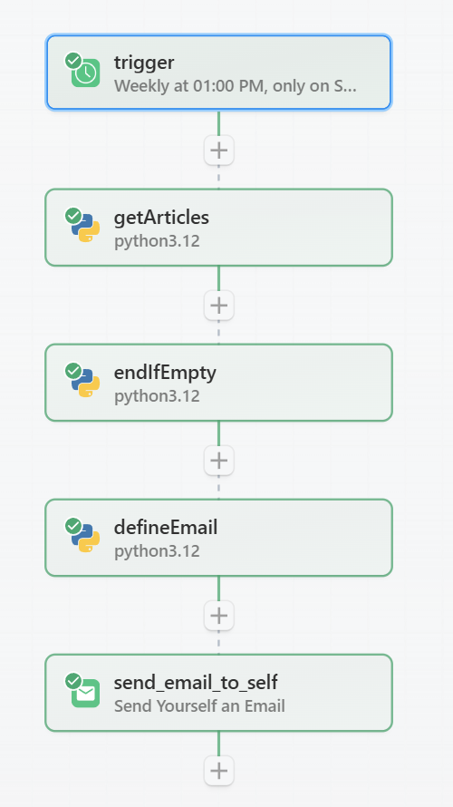

# Automating and Responding to Sentiment Analysis with Diffbot's Knowledge Graph

Diffbot's [Knowledge Graph](https://www.diffbot.com/products/knowledge-graph/) has a simple purpose - bring the sum total of all knowledge to your fingertips via a search that emphasis data and relations over a simple text based search engine experience. Sourced by the entire web, Knowledge Graph lets you perform complex queries against billions of data points instantly via a simple API. I decided to take a spin with their API and build a "relatively" simple tool - news analysis for a product run in on automated platform. Should be easy, right? Let's get to it. Note that the examples in this blog post assume you've gotten a [free key](https://app.diffbot.com/get-started) from Diffbot. Be sure to do that before trying the samples. 

## Designing the Query

Before writing a line of code, I signed into Diffbot and opened up their visual search tool for Knowledge Graph. The tool lets you build queries visually or by hand. Queries are known as 'DQL' statements in Diffbot and are pretty simple to read even if you've never seen the syntax before.



From this tool, I started off by selecting an entity type. This is the high level type of data I want to search and can be one of many numerous options, from people to events to movies and investments. I selected "Article" as my intent is to find news that's speaking ill of my wonderful product. I then selected a "Filter By" option. While you can filter by any property in the entity type, I used `text` as I didn't want to limit my results to items that mentioned by product by title. For the value, I selected "xbox". Lastly, I set the "Sort by" value to show newest first. I then hit search to see if my results made sense:



Right away, I see that my results include items in languages I can't speak, so I then added a filter by language. Hitting the + sign by the current filter, I was then able to add language and `en` for English. Once again, I hit search:



Alright, so next, I want to filter to just negative results. Knowledge Graph Article entities have a sentiment score (you can see them in the search results) that go from -1 to most negative to 1 to most positive. Initially, I simply selected items with a sentiment less than or equal to 0.



Woot, getting there. As a final step, I knew this was going to be automated and filtered to 'recent' items, so I added one more filter, this time on `date`, selected after, and picked a date from a week ago.


At this point, the query looks good, so let's copy out the query value provided by the tool:

```
type:Article text:"xbox" language:"en" sentiment<=0 date>"2025-03-03" sortBy:date
```

## Write the Code

Designing the query was really the hard part. For the code, I went to the [Search](https://docs.diffbot.com/docs/kg-search) docs. The examples are curl/HTTP based but quite easy to port to Python or any other language. Consider this sample:

```python
import os 
import requests 
import json 
import urllib.parse

token = os.environ.get("db_token")

query = 'type:Article text:"xbox" language:"en" sentiment<=0 date>"2025-03-03" sortBy:date'

apiCall = f"https://kg.diffbot.com/kg/v3/dql?type=query&token={token}&query={urllib.parse.quote(query)}&size=25"

req = requests.get(apiCall)
results = json.loads(req.content)
print(f"Total results, {results['hits']}")

for result in results["data"]:
	print(result["entity"]["title"])
	print(result["entity"]["date"]["str"])
	print(result["entity"]["summary"])
	if "author" in result["entity"]:
		print(result["entity"]["author"])
	print(result["entity"]["siteName"])
	print(result["entity"]["pageUrl"])
	print(result["entity"]["sentiment"])

	print("------------------------------------")
```

Breaking this down - I began with my query from the visual tool. This then gets url encoded and passed to the API for Knowledge Graph. The only real new item there is the addition of `size=25` to keep the result set to a sensible limit. 

I call the API, print the total results found (from the `hits` result) and then iterate over each showing various bit of info from the result. Here's a few of the results:

```
Total results, 675
Convicted Pentagon leaker Jack Teixeira faces court-martial while already serving 15-year sentence
d2025-03-10T16:20:56
Jack Teixeira, a Massachusetts Air National Guard member who pleaded guilty last year to leaking hig...
Time Bulletin USA
https://timebulletin.us/convicted-pentagon-leaker-jack-teixeira-faces-court-martial-while-already-serving-15-year-sentence/
-0.286
------------------------------------
Monster Hunter Wilds First Xbox Update Now Live, Here Are The Full Patch Notes
d2025-03-10T16:10
Developer Capcom has today unleashed its first Monster Hunter Wilds patch on all platforms, includin...
Ben Kerry
Pure Xbox
https://www.purexbox.com/news/2025/03/monster-hunter-wilds-first-xbox-update-now-live-here-are-the-full-patch-notes
-0.184
------------------------------------
How to Control Ball Flight, Shape, and Spin in PGA Tour 2K25
d2025-03-10T16:07
The latest game in EA's biannual golf series PGA Tour 2K25 is here and if you've found yourself stru...
Robert Preston
Operation Sports
https://www.operationsports.com/how-to-control-ball-flight-shape-and-spin-in-pga-tour-2k25/
-0.276
------------------------------------
Doom: The Dark Ages Could Be The Start Of New Doom Medieval Games
d2025-03-10T15:50:17
The game won't end with Doom Slayer in a coffin.
Doom fans are eagerly counting down the days until ...
Dennis Patrick
Gameranx
https://gameranx.com/updates/id/531853/article/doom-the-dark-ages-could-be-the-start-of-new-doom-medieval-games/
0
------------------------------------
```

This works, but now let's make the date dynamic. I began importing from `datetime`:

```python
from datetime import datetime, timedelta
```

I then generated a formatted date for last week:

```python
today = datetime.now()
lastWeek = today + timedelta(days=-7)
fLastWeek = lastWeek.strftime("%Y-%m-%d")
```

And the last bit was to just include that date in my query:

```python
query = f'type:Article text:"xbox" language:"en" sentiment<=0 date>{fLastWeek} sortBy:date'
```

You can see the complete source code for the initial version [here](https://github.com/cfjedimaster/writing/blob/main/kg_sentiment_analysis/test1.py) and the final version [here](https://github.com/cfjedimaster/writing/blob/main/kg_sentiment_analysis/test2.py).

## Building the Automation

Alright, time to automate this. For my automation, I'll be making use of [Pipedream](https://pipedream.com), an *incredibly* flexible workflow system I've used many times in the past. Here's the entire workflow with each part built out:



I began my workflow with a simple schedule based trigger, ie, when to run. This was somewhat arbitrary, but I picked weekly, on Sunday, at 1PM.

The next step, `getArticles`, handles the logic I demonstrated earlier, but now in a "Pipedream handler", which is the standard way to write code steps in Pipedream workflow. 

```python
import os 
import requests 
import json 
from datetime import datetime, timedelta
import urllib.parse

def handler(pd: "pipedream"):

  token = os.environ.get("db_token")
  
  today = datetime.now()
  lastWeek = today + timedelta(days=-7)
  fLastWeek = lastWeek.strftime("%Y-%m-%d")

  query = f'type:Article text:"xbox" language:"en" sentiment<=0 date>{fLastWeek} sortBy:date'
  
  apiCall = f"https://kg.diffbot.com/kg/v3/dql?type=query&token={token}&query={urllib.parse.quote(query)}&size=25"
  
  req = requests.get(apiCall)
  return json.loads(req.content)
```

The next step is simply a quick code step to end the workflow if no results are found:

```python
def handler(pd: "pipedream"):

    if len(pd.steps["getArticles"]["$return_value"]["data"]) == 0:
      pd.flow.exit("No results")
```

Now I want to 'massage' the results a bit. I'm going to eventually email this to myself, so I built a step to format the results in a nice string:

```python
from datetime import datetime

def handler(pd: "pipedream"):

  email = f"""
Negative Article Results:

Our search found {pd.steps["getArticles"]["$return_value"]["hits"]} results. Here are the top 25:
  """  

  for result in pd.steps["getArticles"]["$return_value"]["data"]:
    date = datetime.fromtimestamp(result["entity"]["date"]["timestamp"] / 1000)
    date_f = date.strftime("%Y-%m-%d")
    
    email += f"""
{result["entity"]["title"]}
Sentiment:  {result["entity"]["sentiment"]}
Published:  {date_f}
Link:       {result["entity"]["pageUrl"]}
    """

  return email
```

Again, this is somewhat arbitrary in terms of what I thought important enough to include. You could definitely get more fancier, and even do things like, "on a really bad sentiment, add color, red flags, etc". 

The final step was to simply email myself the results. Pipedream supports a "send an email to the account owner" step that will do just that, email me. If I were building this out for a client, I'd use one of the many Pipedream built-in steps for mail APIs. 

Once run, I get a nice email with a list of articles and their sentiment:


If you choose to give Pipedream a spin, you can find my workflow here: <https://github.com/cfjedimaster/General-Pipedream-AI-Stuff/tree/production/report-on-sentiment-p_gYCeNbG>

## What's Next?

This is just one example of using Diffbot's Knowledge Graph API, and as a reminder, articles are only one of the many different types of data you can search. Everything I did here was also done on a *completely free account*, so you can absolutely sign up and try it out yourself. I'm going to be digging into this more so let me know if you've got any questions!