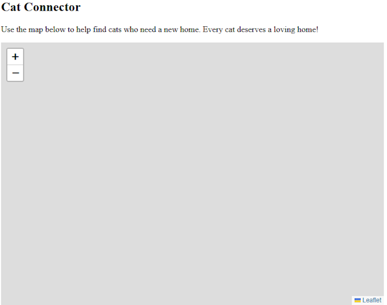

# Mapping with Leaflet

It seems relatively simple - you have some data that involves location and you want to display them on a map. But how do you choose which service to use? Most folks default to Google Maps, which is a very powerful platform, but also comes with probably way more than you need, and has a cost involved at a certain level. What if there were a simpler, smaller, and dare I say, free and open source alternative? [Leaflet.js](https://leafletjs.com/) is exactly that. Incredibly simple and flexible, it lets you quickly add interactive maps to your web pages with little overhead. 

Before we jump into code, let's consider a simple, but realistic example. You run a website that helps prospective cat owners find cats that need a new home. Your data comes from an API (which for our sake will be just a JSON file) and includes information like:

* Characterstics of the cat
* How to contact the current owner
* Where the cat could be picked up, a location in latitude and longitude. 

What we want to do here is see how much effort is required to add this to a web page. Let's get start!

## Including the Library

We'll start with a simple bit of HTML. I'm using CodePen for the samples so this will be a subset of the entire page of course. First, just some introductory content and a place for our map.

```html
<h2>Cat Connector</h2>

<p>
	Use the map below to help find cats who need a new home. Every cat deserves a loving home!
</p>

<div id="map"></div>
```

The map will need a size of some sort, so I used the following CSS:

```css
#map {
	width: 100%;
	height: 500px;
}
```

If you follow the [Leaflet Quick Start](https://leafletjs.com/examples/quick-start/), you can see two dependencies that need adding, first, a CSS resource:

```html
<link rel="stylesheet" href="https://unpkg.com/leaflet@1.9.4/dist/leaflet.css"
     integrity="sha256-p4NxAoJBhIIN+hmNHrzRCf9tD/miZyoHS5obTRR9BMY="
     crossorigin=""/>
```

And then the library itself:

```html
<script src="https://unpkg.com/leaflet@1.9.4/dist/leaflet.js"
     integrity="sha256-20nQCchB9co0qIjJZRGuk2/Z9VM+kNiyxNV1lvTlZBo="
     crossorigin=""></script>
```

For CodePen, this was done via the pen settings. 

Now, we need to actually add the map, and here's where you need to think a bit. In order to create a map, you'll need a location to begin with. What this location is depends on a lot of factors. If I were rendering maps in the continental United States, I could center it on America. If I were mapping castles in Germany, obviously I'd pick a location somewhere in the country. 

Another factor you have to consider is the initial zoom. How close, or how far, the map initially shows itself will also depend on the kind of data you're rendering. 

For our pretend cat rehoming website, we'll assume Lafayette, Louisiana, which just so happens to be where I live. The latitude of Lafayette is 30.216667 and the longitude is -92.033333.

This can be done with one line:

```js
let map = L.map('map').setView([30.216667, -92.033333], 12);
```

If you were to run this right now, you would see:



Where's the map? The final part you need is a tile provider. Map tiles are the parts that make up any interactive map. As you go to different locations, and different zoom levels, the map is rendered from a set of tiles, based on those factors (location and zoom). OpenStreetMap provides free map tiles (with attribution!) and can be added to Leaflet like so:

```js
L.tileLayer('https://tile.openstreetmap.org/{z}/{x}/{y}.png', {
    maxZoom: 19,
    attribution: '&copy; <a href="http://www.openstreetmap.org/copyright">OpenStreetMap</a>'
}).addTo(map);
```

Let's take a look at what we have so far:

<p class="codepen" data-height="300" data-theme-id="dark" data-default-tab="result" data-slug-hash="VYZdqZL" data-pen-title="FM - Leaflet 1" data-editable="true" data-user="cfjedimaster" style="height: 300px; box-sizing: border-box; display: flex; align-items: center; justify-content: center; border: 2px solid; margin: 1em 0; padding: 1em;">
  <span>See the Pen <a href="https://codepen.io/cfjedimaster/pen/VYZdqZL">
  FM - Leaflet 1</a> by Raymond Camden (<a href="https://codepen.io/cfjedimaster">@cfjedimaster</a>)
  on <a href="https://codepen.io">CodePen</a>.</span>
</p>
<script async src="https://public.codepenassets.com/embed/index.js"></script>

One thing to note here is - we haven't actually added any data yet and it's possible we may need to tweak multiple things. Maybe the map needs to be bigger? Maybe our centered location isn't quite right. Our default zoom may not be optimal either. These are all things that will come into play as we start adding data, so let's do that next!

## Our Data

Before we get into how Leaflet can show data, let's look at our sample data. Our cats will be returned as static data, an array of results. Here's a portion of the data:

```js
let availableCats = [
	{
		"cat": {
			"name":"Fluffy",
			"age":5, 
			"gender":"male",
			"breed":"calico"
		},
		"owner": {
			"name":"Raymond Camden",
			"contactEmail":"raymondcamden@gmail.com",
			"contactPhone":"555-555-5555"
		},
		"location": {
			"latitude": 30.227394,
			"longitude": -92.029090
		}
	},
	{
		"cat": {
			"name":"Pig",
			"age":12, 
			"gender":"female",
			"breed":"calico"
		},
		"owner": {
			"name":"Lindy Camden",
			"contactEmail":"lindyjcamden@gmail.com",
			"contactPhone":"555-555-5555"
		},
		"location": {
			"latitude": 30.231695,
			"longitude": -92.007103
		}
	}
]
```

To emulate a simple API call, we can wrap this up in a function like so:

```js
async function getAvailableCats() {
	return [
		// list of cats here...
	]
}
```

And then update our code to let us call this asynchronously:

```js
document.addEventListener('DOMContentLoaded', init, false);
async function init() {

	let cats = await getAvailableCats();
	
	let map = L.map('map').setView([30.216667,-92.033333], 12);

	L.tileLayer('https://tile.openstreetmap.org/{z}/{x}/{y}.png', {
			maxZoom: 19,
			attribution: '&copy; <a href="http://www.openstreetmap.org/copyright">OpenStreetMap</a>'
	}).addTo(map);

}
```

At this point, we've got data, but how to add it to the map? Leaflet lets you 'draw' on a map in many different ways, but the simplest is by adding a marker:

```js
let marker = L.marker([latitude, longitude]).addTo(map);
```

Since we got the cats earlier in the function, we just need to loop over them:

```js
cats.forEach(c => {
	let marker = L.marker([c.location.latitude, c.location.longitude]).addTo(map);
});
```

You can see this version below:

<p class="codepen" data-height="300" data-theme-id="dark" data-default-tab="result" data-slug-hash="QwLxzEr" data-pen-title="FM - Leaflet 2" data-editable="true" data-user="cfjedimaster" style="height: 300px; box-sizing: border-box; display: flex; align-items: center; justify-content: center; border: 2px solid; margin: 1em 0; padding: 1em;">
  <span>See the Pen <a href="https://codepen.io/cfjedimaster/pen/QwLxzEr">
  FM - Leaflet 1</a> by Raymond Camden (<a href="https://codepen.io/cfjedimaster">@cfjedimaster</a>)
  on <a href="https://codepen.io">CodePen</a>.</span>
</p>
<script async src="https://public.codepenassets.com/embed/index.js"></script>

Notice that it's possible that changing the zoom may help here, there's a lot of space around the data and we could get closer in. However, maybe we know our organization could, at any time, get more data farther out. This is exactly what I was talking about in terms of understanding your data, both what's immediately available and what may come later. (As an aside, Leaflet also supports the idea of taking a set of locations and ensuring they all 'fit' by default. That's just one example of how powerful the API is, but we'll keep it simple for now.)

## Adding Interactivity

Now for the last part of the puzzle. In order for the information on the map to actually be useful, we need to associate the data for those markers and provide some form of UI to share that with the users. In it's simplest form, Leaflet lets you bind popups to markers in, literally, one simple method call. 

You take this:

```js
let marker = L.marker([latitude, longitude]).addTo(map);
```

And add:

```js
let marker = L.marker([latitude, longitude]).addTo(map).bindPopup('Set some HTML or just regular text here.');
```

And that's it! So given our loop over the cat data, here's a new version with that. I created a template string to more nicely format the information:

```js
	cats.forEach(c => {
		let desc = `
<h3>${c.cat.name}</h3>
<p>
${c.cat.name} is a ${c.cat.gender} ${c.cat.breed}.
</p>
<p>
Owner: ${c.owner.name}<br>
Email: ${c.owner.contactEmail}<br>
Tel: ${c.owner.contactPhone}<br>
</p>
		`;
		L.marker([c.location.latitude, c.location.longitude]).addTo(map).bindPopup(desc);
	});
}
```

This one method handles the click interaction, creating the popup, even automatically closing another popup if you forget to close one. Here's the complete demo:

<p class="codepen" data-height="300" data-theme-id="dark" data-default-tab="result" data-slug-hash="zxOJNEP" data-pen-title="FM - Leaflet 3" data-editable="true" data-user="cfjedimaster" style="height: 300px; box-sizing: border-box; display: flex; align-items: center; justify-content: center; border: 2px solid; margin: 1em 0; padding: 1em;">
  <span>See the Pen <a href="https://codepen.io/cfjedimaster/pen/zxOJNEP">
  FM - Leaflet 2</a> by Raymond Camden (<a href="https://codepen.io/cfjedimaster">@cfjedimaster</a>)
  on <a href="https://codepen.io">CodePen</a>.</span>
</p>
<script async src="https://public.codepenassets.com/embed/index.js"></script>

## What Else?

This introduction only scratches the surface of what's possible and you should peruse the [docs](https://leafletjs.com/reference.html) for a full idea. Leaflet is great, and free, but, you should also be aware of some of the things you *don't* get that you would with Google Maps or HERE. These include the various 'services', like

* Routing 
* Traffic information 
* Geocoding (and Reverse Geocoding) 

Now, this doesn't mean you can't make use of those services *along* with Leaflet. I discussed an example of this late last year: ["Using Geocoding with Leaflet"](https://www.raymondcamden.com/2024/10/04/using-geocoding-with-leaflet). That being said, keep this in mind when planning your projects as it may impact your decision on whether or not to use the library. 
