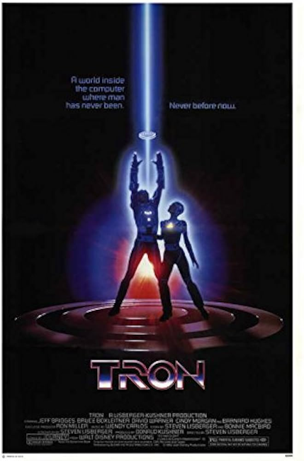
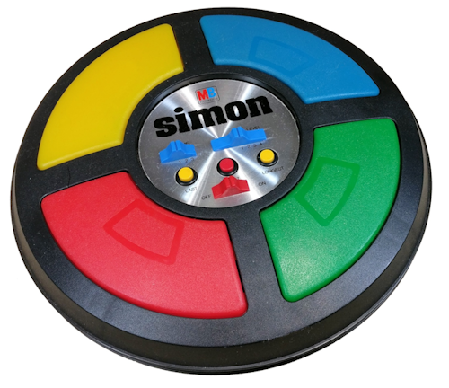

# Shall We Play a Game?

Like many developers, I'm an avid video game player, and actually have been since before I wrote any code. I cut my teeth on *really* old school games including text-based adventures from Infocom and brutal but fun RPGs like "Bard's Tale" and "Ultima". While I'm kinda know as being a Star Wars <strike>freak</strike>fan, another movie from about the same time had a huge impact on me as well. 



If you somehow missed this 80s classic, the basic premise was that a games designer and computer programmer ends up "inside" the world of computers. It's got incredible CGI (for the time) and a story that locked firmly onto my young imagination. I'd like to believe that I wasn't so young as to think that's what programming was really like, but there was probably a small part of me convinced it would definitely be that cool. 

Fast forward a few decades, games programming didn't end up being a good route for me (math is *hard* yall!), but I never stopped *thinking* about building my own games. Over the years, I've encountered quite a few web-based games that were both text-based and incredibly deep. As an example, [Universal Paperclips](https://www.decisionproblem.com/paperclips/index2.html) starts off as a simple clicker game and then gradually morphs into something completely different, and far more complex. Another example, [A Dark Room](https://adarkroom.doublespeakgames.com/) takes a similar approach. (I **strongly** warn you not to click either of those links unless you are prepared to lose a *lot* of time.)

I've taken a stab at building a few games myself, and what I've quickly discovered is that while parts of it are really fun. I wrote up a fun tutorial a few years ago about generating monsters with various stats, bonuses, and so forth: [Making Monsters with JavaScript](https://www.raymondcamden.com/2020/07/19/making-monsters-with-javascript). That was a really fun <strike>waste of time</strike>coding exercise that I imagined could be used in a 'real' game. But real games have a *heck* of a lot going on thats, well, not quite as fun. As a few examples:

* Managing the state of the game in terms of - are we on the intro, is it the computers turn or yours, is the game over, paused, etc?
* Managing the values that control how the game works - things like, how much money does a player start with, how long turns last, and so forth.
* Gameplay testing - in games that have different 'stages' where hours could be required to move from one stage to another, how do you enable the tester to load up the game and quickly shift into where they need to be test.

All of these 'chores' are a vital part of building the game, just aren't necessarily fun. In this series, I'm going to talk about just that - the non-fun, but essential, parts of building a simple web based game. The game will be a recreation of the old Simon memory game:



Gameplay was simple. The computer would light up one of the colors and emit a tone. You then had a few seconds to enter the tone yourself. The computer would then repeat the previous tone, and add a new one. You would then enter the two tones, in the same order. This would continue on until at some point you messed up, heard a failure sound, and the game was over. This was just one of the many anxiety-inducing games of my childhood that I blame for my anxiety now. 

To simplify some of the work, I'll use Alpine.js, which I covered in my last article here (["Why Alpine is the new jQuery and Why that is an Awesome Thing"](https://frontendmasters.com/blog/why-alpine-is-the-new-jquery-and-why-that-is-an-awesome-thing/)). Alpine will gladly help with some of the 'chores', including basic DOM manipulation and state management. While I don't think you will need heavy Alpine.js knowledge to understand how the game is being built, if you've never seen it before you should definitely read my introduction to grok the basics. 

## The First Iteration

In this first iteration, I want to focus on the first item I mentioned above, handling the different 'states' of the game. Our game will have:

* An introduction that explains how Memory works, what will happen when the game starts, and what the player (you!) is expected to do.
* A game state, ie, the actual game itself. Eventually there will be four coloured squares that can light up, make noises, and so forth. 
* A game over state that will provide some information, specifically how many times the player correctly 'answered' the computer. 

Let's start very simple with a set of `div` blocks, one for each stage. In a "heavier" application using a build process and 500 megs of JavaScript or so, these could be routes, but that's way overkill for our needs here.

```html
<div x-data="app">
	
	<div x-show="intro">
		<h2>The Intro</h2>
		<p>
			This is where I'll (eventually) write instructions for how the game works and describe basic game play, etc.
		</p>
		<p>
		<button @click="startGame">Start Game</button>
		</p>
	</div>

	<div x-show="gameActive">
		<h2>The Game</h2>
		<p>
		This is the game. Hope you win.
		</p>
		<p>
		<button @click="endGame">End Game</button>
		</p>
	</div>

	<div x-show="gameOver">
		<h2>Game Over</h2>
		<p>
			The only way to win... is not to play.
		</p>
		<p>
		<button @click="startGame">New Game</button>
		</p>
	</div>

</div>
```

Hopefully you read that Alpine intro I linked to, but basically, each of the three 'child' divs has a directive, `x-show`, that says whether or not that item should be shown. I'm going to use three variables for this, which is a personal choice. I could have used one instead, for example:

```html
<div x-show="gameStage == 'intro'">
</div>
<div x-show="gameStage == 'gameActive'">
</div>
(and so forth)
```

But I prefer the 'look' of the simpler HTML. This is absolutely moving into personal preference territory, but I like my HTML template code to be as simple as possible. 

My Apline application starts like so:

```js
 Alpine.data('app', () => ({
	// gamestate
	intro:false, gameActive: false, gameOver:false, 
	init() {
		this.intro = true;
	}, 
	// more...
```

I set all three variables to false, and in the `init`, set `intro` to true. I could have defaulted `intro` to `true`, but again, this just feels better. Later on I may need to load in assets or do other 'work' where I don't want the intro screen visible yet. And heck, I may end up needing a new state for "loading".

Next, notice the buttons. For this first iteration, it's how I'll handle the player moving from one state to another. The first button runs the method, `startGame`:

```js
startGame() {
	this.intro = false;
	this.gameActive = true;
	this.gameOver = false;
}
```

Basically, hide the intro, show the game, and hide the game over screen. I need that because the game over state *also* calls `startGame`, and will need to hide itself. I expect there'll be a lot more code here in the future, but for now, it does what it needs to. 

The final method, `endGame`, would *not* normally be clicked by the player. Instead, it would happen if the player hit the wrong color, or didn't respond quickly enough. 

```js
endGame() {
	this.gameActive = false;
	this.gameOver = true;
},
```

Again, I expect more code to be here in the future, but it handles what it needs to - shifting the current visible game state. 

## "Play" It Now!

You can now play this game below. It's not terribly fun, but also isn't nearly as stressful:

<p class="codepen" data-height="300" data-theme-id="dark" data-default-tab="result" data-slug-hash="GgKoRLg" data-pen-title="Memory P1" data-editable="true" data-user="cfjedimaster" style="height: 300px; box-sizing: border-box; display: flex; align-items: center; justify-content: center; border: 2px solid; margin: 1em 0; padding: 1em;">
  <span>See the Pen <a href="https://codepen.io/cfjedimaster/pen/GgKoRLg">
  Memory P1</a> by Raymond Camden (<a href="https://codepen.io/cfjedimaster">@cfjedimaster</a>)
  on <a href="https://codepen.io">CodePen</a>.</span>
</p>
<script async src="https://cpwebassets.codepen.io/assets/embed/ei.js"></script>

## What's Next?

In the next part of this series, I'll demonstrate basic gameplay with a focus on how the game settings need to be tested, abstracted properly, and so forth, to make the game actually playable and fun. 

