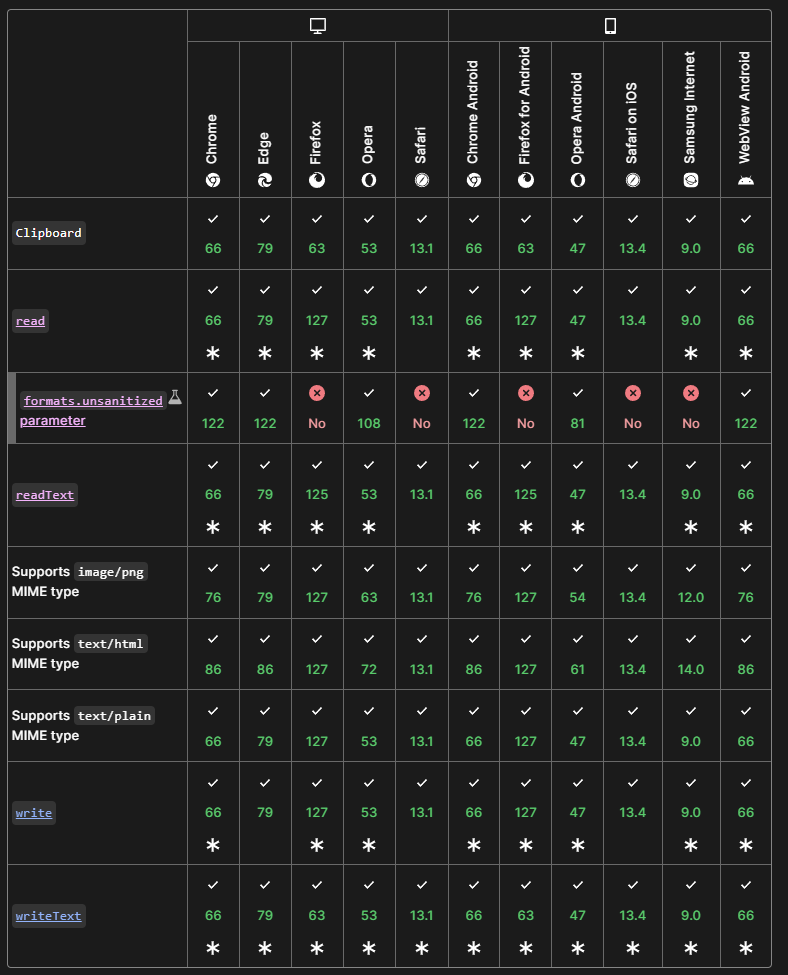

# Writing to the Clipboard

In my [last article](https://frontendmasters.com/blog/reading-from-the-clipboard-in-javascript/), I showed you how to enable your website to read a visitor's clipboard. Now I'm going to follow up that guide with a look at *writing* to the clipboard. It goes without saying that in any use of this type of functionality, you should proceed with care and, most of all, respect for your visitors. I'll talk a bit about what that means later in the article, but for now, let's look at the API.

## Before We Begin...

As I said last time, clipboard functionality on the web requires a "secure context". So if you're running an http site (as opposed to an https site), these features will not work. I'd highly encourage you to get your site on https. That being said, these features, and others like them that require secure contexts, will still work on http://localhost. There's no need to set up a temporary certificate when doing local testing.

## The Clipboard API

I covered this last time, but in case you didn't read the previous article in this series, the [Clipboard API](https://developer.mozilla.org/en-US/docs/Web/API/Clipboard) is supported in JavaScript via `navigator.clipboard` and has excellent cross-platform support:



This feature will also prompt the user for permission so remember to handle cases where they reject the request. 

## Writing to the Clipboard

When I last discussed the clipboard API, I mentioned how it had two APIs for reading from the clipboard, we had a `readText` method tailored for, you guessed it, reading text, and a more generic `read` method for handling complex data. Unsurprisingly, we've got the same on the write side:

* write
* writeText

And just like before, `writeText` is specifically for writing text to the clipboard while `write` gives you additional flexibility. 

At the simplest, you can use it like so:

```js
await navigator.clipboard.writeText("Hello World!");
```

That's literally it. Here's a CodePen demonstrating an example of this, but you will most likely need to make use of the 'debug' link to see this in action due to security issues on the CodePen side:

<p class="codepen" data-height="300" data-default-tab="result" data-slug-hash="XWLVRGX" data-pen-title="Clipboard Reading" data-user="cfjedimaster" style="height: 300px; box-sizing: border-box; display: flex; align-items: center; justify-content: center; border: 2px solid; margin: 1em 0; padding: 1em;">
  <span>See the Pen <a href="https://codepen.io/cfjedimaster/pen/XWLVRGX">
  Clipboard Reading</a> by Raymond Camden (<a href="https://codepen.io/cfjedimaster">@cfjedimaster</a>)
  on <a href="https://codepen.io">CodePen</a>.</span>
</p>
<script async src="https://cpwebassets.codepen.io/assets/embed/ei.js"></script>

One pretty simple and actually practical use-case for something like this is quickly copying links to the user's clipboard. Let's consider some simple HTML:

```html
<div class="example">
  <p>
    <a href="https://www.raymondcamden.com">My blog</a><br />
    <a href="https://frontendmasters.com/blog/">Frontend Masters blog</a>
  </p>

  <p>If this doesn't work for you <a href="https://codepen.io/pen/debug/ZEdvKgb" target="_blank">try Debug Mode</a>.</p>
</div>
```

What I want to do is - pick up all the links (filtered by something logical), and automatically add a UI item that will copy the URL to the clipboard:

```js
links = document.querySelectorAll("div.example p:first-child a");

links.forEach((a) => {
  let copy = document.createElement("span");
  copy.innerText = "[Copy]";
  copy.addEventListener("click", async () => {
    await navigator.clipboard.writeText(a.href);
  });
  a.after(copy);
});
```

I begin with a selector for the links I care about, and for each, I append a span element with `[Copy]` as the text. Each new element has a click handler to support copying its related URL to the clipboard. As before, here's the CodePen but expect to need the debug link:

<p class="codepen" data-height="300" data-default-tab="result" data-slug-hash="ZEdvKgb" data-pen-title="Clipboard Writing " data-user="cfjedimaster" style="height: 300px; box-sizing: border-box; display: flex; align-items: center; justify-content: center; border: 2px solid; margin: 1em 0; padding: 1em;">
  <span>See the Pen <a href="https://codepen.io/cfjedimaster/pen/ZEdvKgb">
  Clipboard Writing </a> by Raymond Camden (<a href="https://codepen.io/cfjedimaster">@cfjedimaster</a>)
  on <a href="https://codepen.io">CodePen</a>.</span>
</p>
<script async src="https://cpwebassets.codepen.io/assets/embed/ei.js"></script>

As a quick note, the UX of this demo could be improved. I'd add a pointer style to the text so it's obvious it's clickable and perhaps notify the user in some small way that you performed the action.

Now let's kick it up a notch and look into how to support binary data with the `write` method.

The basic interface for `write` is to pass an array of [`ClipboardItem`](https://developer.mozilla.org/en-US/docs/Web/API/ClipboardItem) objects. The MDN docs for [write](https://developer.mozilla.org/en-US/docs/Web/API/Clipboard/write) provide this example:


```js
const type = "text/plain";
const blob = new Blob([text], { type });
const data = [new ClipboardItem({ [type]: blob })];
await navigator.clipboard.write(data);
```

That seems sensible. For my first attempt, I decided to add simple "click to copy" support to an image. So consider this HTML:

```html

```

I could support this like so:

```js
document.addEventListener('DOMContentLoaded', init, false);

async function init() {
	document.querySelector('img').addEventListener('click', copyImagetoCB);
}

async function copyImagetoCB(e) {
	// should be dynamic
	let type = 'image/jpeg';
	let dataReq = await fetch(e.target.src);
	let data = await dataReq.blob();

	let blob = new Blob([data], { type });

	let cbData = [new ClipboardItem({ [type]: blob })];
	await navigator.clipboard.write(cbData);

	console.log('Done');
}
```

This code picks up the one and only image, adds a click handler, and makes use of the MDN sample code, updated to use a hard-coded type (JPG) and to fetch the binary data. (This kind of bugs me. I know the image is loaded in the DOM so it feels like I should be able to get access to the bits without another network call, but from what I can see, you can only do this by using a Canvas object.)

But when run, you get something interesting:

```
Uncaught (in promise) DOMException: Failed to execute 'write' on 'Clipboard': Type image/jpeg not supported on write.
```

What??? Turns out, this is actually documented on MDN:

<blockquote>
Browsers commonly support writing text, HTML, and PNG image data
</blockquote>

This seems... crazy. I mean I definitely get having some restrictions, but it feels odd for only one type of image to be supported. However, changing my HTML:

```

```

And the type in my JavaScript:

```js
let type = 'image/png';
```

Confirms that it works. You can see this yourself below (and again, hit that 'Debug' link):

<p class="codepen" data-height="300" data-theme-id="dark" data-default-tab="result" data-slug-hash="MWMrzya" data-pen-title="Clipboard Writing 2" data-editable="true" data-user="cfjedimaster" style="height: 300px; box-sizing: border-box; display: flex; align-items: center; justify-content: center; border: 2px solid; margin: 1em 0; padding: 1em;">
  <span>See the Pen <a href="https://codepen.io/cfjedimaster/pen/MWMrzya">
  Clipboard Writing 2</a> by Raymond Camden (<a href="https://codepen.io/cfjedimaster">@cfjedimaster</a>)
  on <a href="https://codepen.io">CodePen</a>.</span>
</p>
<script async src="https://cpwebassets.codepen.io/assets/embed/ei.js"></script>

So remember above when I said I didn't want to use a canvas? I did some Googling and turns out... I need to use a canvas. I found an excellent example of this on StackOverflow in this [answer](https://stackoverflow.com/a/62911176/52160). In it, the author uses a temporary canvas, writes the image data to it, and uses `toBlob` while specifying a PNG image type. Whew. So let's see if we can build a generic solution.

First, I updated my HTML to support two images:

```html
<div class="photos">
	<p>
	JPG:<br/>
	
	</p>
	<p>
	PNG:<br/>
	
	</p>
</div>
```

I labeled them as I was using the same picture each and needed a simple way to know which was which.

Next, I updated my code to pick up *all* images in that particular div:

```js
document.addEventListener('DOMContentLoaded', init, false);

async function init() {
	let imgs = document.querySelectorAll('div.photos img');
	imgs.forEach(i => {
		i.addEventListener('click', copyImagetoCB);
	});
}
```

Now for the fun part. I'm going to update my code to detect the type of the image. For PNG's, it will use what I showed before, and for JPGs, I'm using a modified version of the StackOverflow answer. Here's the updated code:

```js
async function copyImagetoCB(e) {

	let type = e.target.src.split('.').pop();
	let blob;
	console.log('type', type);

	// support JPG/PNG only
	if(type === 'jpg' || type === 'jpeg') {
	
		blob = await setCanvasImage(e.target.src);

	} else if(type.endsWith('png')) {
		let dataReq = await fetch(e.target.src);
		let data = await dataReq.blob();

		blob = new Blob([data], { type:'image/png' });
	}

	let cbData = [new ClipboardItem({ 'image/png': blob })];
	await navigator.clipboard.write(cbData);
	console.log('Done');

}

async function setCanvasImage(path) {

	return new Promise((resolve, reject) => {
		const img = new Image;
		const c = document.createElement('canvas');
		const ctx = c.getContext('2d');

		img.onload = function() {
			c.width = this.naturalWidth
			c.height = this.naturalHeight
			ctx.drawImage(this,0,0)
			c.toBlob(blob=>{
				resolve(blob)
			},'image/png')
		}
		img.src = path;
	});
}
```

You'll note that the main difference is how we get the blob. For JPGs, we're using `setCanvasImage` to handle the canvas shenanigans (that's what I'm calling it) and return a PNG blob. 

You can see this in the CodePen below, if, again, you click out to the debug view. Note that I had to add one additional line:

```js
img.crossOrigin = "anonymous";
```

As without it, you get a tainted canvas error. Sounds dirty. 

<p class="codepen" data-height="300" data-theme-id="dark" data-default-tab="result" data-slug-hash="PorExKV" data-pen-title="Clipboard Writing Img" data-editable="true" data-user="cfjedimaster" style="height: 300px; box-sizing: border-box; display: flex; align-items: center; justify-content: center; border: 2px solid; margin: 1em 0; padding: 1em;">
  <span>See the Pen <a href="https://codepen.io/cfjedimaster/pen/PorExKV">
  Clipboard Writing Img</a> by Raymond Camden (<a href="https://codepen.io/cfjedimaster">@cfjedimaster</a>)
  on <a href="https://codepen.io">CodePen</a>.</span>
</p>
<script async src="https://cpwebassets.codepen.io/assets/embed/ei.js"></script>

## With Great Power...

So it goes without saying that this API could be abused, or, more likely, used in kind of a jerky manner. So for example, if you give the user the ability to click to copy a URL, don't do sneaky crap like:

"(url here) - This URL comes from the awesome site X and you should visit it for deals!"

If you are expressing to the user that you are copying something in particular, adding to it or modifying it is simply rude. I'd even suggest that copying a short URL link instead of the original would be bad form as well. 